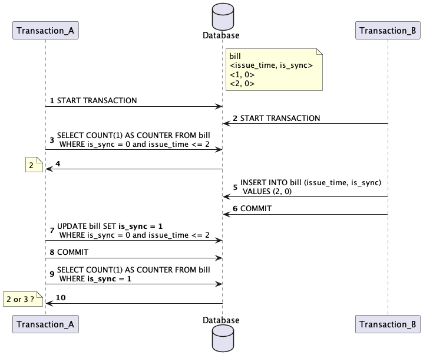

## A snippet for testing databases on a bug occurred before when using MySql_5.7

### Stack

JAVA, testcontainers

### The context of the bug

### Result

Expect the return is 2.

| database     | isolation | return                         |
|--------------|-----------|--------------------------------|
| MySQL 5.7, 8 | RR        | 3                              |
| MySQL 5.7, 8 | SER       | "Lock wait timeout" on step 5. |
| Postgres 9   | RR        | 2                              |
