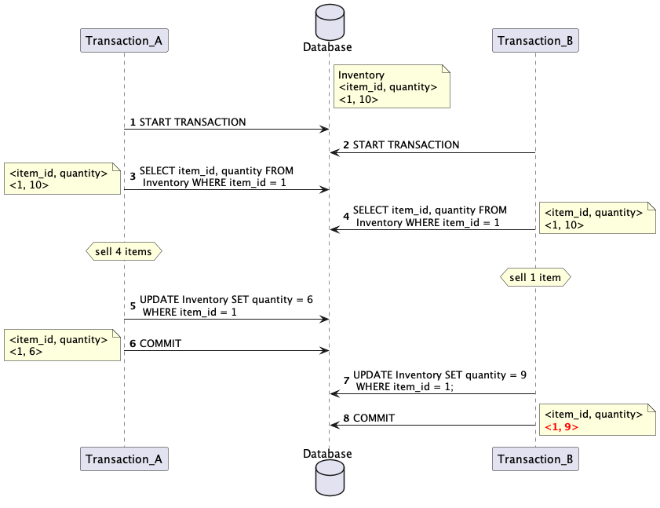

## A snippet for testing databases on a bug occurred before when using MySql_5.7

### Stack

JAVA, testcontainers

### The context of the bug


#### How to fix it?
Change Sept 8. to
```SQL
UPDATE bill SET is_sync = 1  WHERE bill_id in (A,B);
```

### Result

Expect the return is **2**.

| database     | isolation       | return                         |
|--------------|-----------------|--------------------------------|
| MySQL 5.7, 8 | REPEATABLE_READ | 3                              |
| MySQL 5.7, 8 | SERIALIZABLE    | "Lock wait timeout" on step 5. |
| Postgres 9   | REPEATABLE_READ | 2                              |
| Postgres 9   | READ_COMMITTED  | 3                              |

## Bonus test for LOST UPDATE

### Simulation


#### How to fix it on R-R isolation in MySQL?
1. Atomic Operations
```
item_id UNSIGNED INT
```
```SQL
UPDATE Inventory SET quantity = quantity - 4 WHERE item_id = 1
```
2. LOCK
```SQL
SELECT item_id, quantity FROM  Inventory WHERE item_id = 1 FOR UPDATE;
```

### Result
Expect the quantity of item 1 is **6**.

| database     | isolation       | quantity of item 1                                                  |
|--------------|-----------------|---------------------------------------------------------------------|
| MySQL 5.7, 8 | REPEATABLE_READ | 9                                                                   |
| MySQL 5.7, 8 | SERIALIZABLE    | "Lock wait timeout" on step 5.                                      |
| Postgres 9   | REPEATABLE_READ | 6 "could not serialize access due to concurrent update"  on step 7. |
